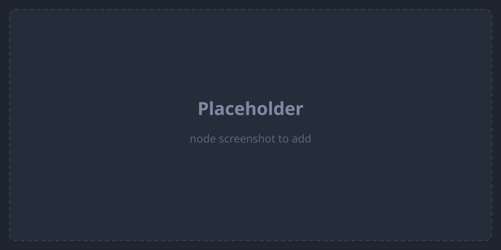

`claude_code.judge`

**Claude Code Judge** is the agentic variant of [LLM Judge](/en/nodes/llm-judge/): it evaluates its `subject` input using the Claude Code CLI as a real agent (tools + workspace `cwd`), driven by acceptance criteria supplied as the system prompt. It shares the same three-port contract — `approved`, `rejected`, `exhausted` — and the same bounded auto-loop on `rejected` via an `isLoop` transition.

The criteria come from the optional `criteria` input (typically a [Skill Loader](/en/nodes/skill-loader/)) when wired, otherwise from `config.judgePrompt`.

## Ports

| Direction | Port | Kind | Notes |
| --- | --- | --- | --- |
| Input | `subject` | `*` | **Primary**, required. The artifact being judged; its content is sent in the user prompt. |
| Input | `criteria` | `Markdown`, `*` | **Optional.** Acceptance criteria used as the agent's system prompt; takes precedence over `config.judgePrompt`. |
| Output | `approved` | `config.approvedKind` (default `Markdown`) | Verdict is approved: the subject is re-emitted unchanged (pass-through). |
| Output | `rejected` | `Markdown` | Verdict is rejected and attempts remain: judge feedback. Wire an `isLoop` transition here for the auto-loop. |
| Output | `exhausted` | `Markdown` | Same feedback as `rejected`, emitted when no attempts remain. Typically wired to a human gate. |

Only the produced port fires; steps wired to the other ports are skipped in cascade.

## Configuration

| Key | Type | Default | Description |
| --- | --- | --- | --- |
| `judgePrompt` | `string` | `""` | Acceptance criteria used when no `criteria` input is wired. **Required** from one of the two sources — the runner throws if both are empty. |
| `model` | `string` | `claude-opus-4-7` | Model used for the verdict. |
| `maxAttempts` | `number` | `3` | Max judge attempts (1-indexed). Must be a positive integer; `exhausted` fires once `attempt >= maxAttempts - 1`. |
| `maxTokens` | `number` | `8000` | Output token cap for the agent. |
| `approvedKind` | `string` (ArtifactKind) | `Markdown` | Kind declared on the `approved` port. Must be a non-empty string when set. |

## Runtime behavior

1. Reads `model`, `maxTokens`, and `maxAttempts`; requires a `subject` input.
2. Resolves the acceptance criteria: the wired `criteria` input wins, falling back to `config.judgePrompt` (error if both are empty).
3. Passes the criteria as the **system prompt** and the subject (plus JSON output instructions) as the user prompt, invoking the Claude Code CLI in **streaming** mode and recording a **run-log** row.
4. Parses the JSON verdict (`approved` / `rejected`, plus a summary and optional line-anchored comments).
5. On **approved**: re-emits the original subject artifact unchanged on `approved` (pass-through).
6. On **rejected**: renders the feedback as Markdown and routes to `exhausted` when `attempt >= maxAttempts - 1`, otherwise to `rejected`. The loop is driven by the orchestrator via the `isLoop` transition — the runner is loop-agnostic.

## Example

Validate generated output with a Skill-driven, agentic judge:

- Input `subject` ← output of a [Claude Code Invoke](/en/nodes/claude-code-invoke/); `criteria` ← a [Skill Loader](/en/nodes/skill-loader/) (or set `judgePrompt` inline); `maxAttempts`: `3`.
- `approved` → continue the flow; `rejected` → loop back to the generator (via an `isLoop` transition); `exhausted` → [Human Gate](/en/nodes/human-gate/).

## See also

- [Nodes overview](/en/nodes/overview/)
- [LLM Judge](/en/nodes/llm-judge/) — the lighter, prompt-driven judge variant.
- [Skill Loader](/en/nodes/skill-loader/) — provides the acceptance criteria upstream.
- [Human Gate](/en/nodes/human-gate/) — typical target of the `exhausted` port.
