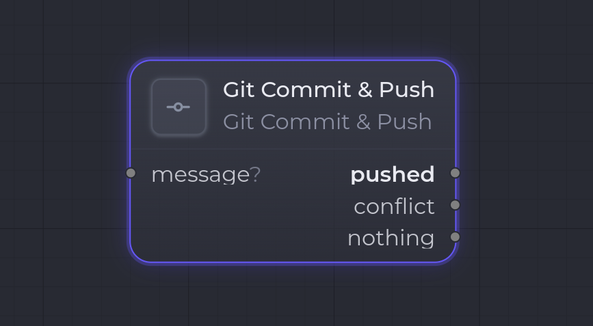

`git.commit_push`

**Git Commit & Push** stages the explicit `paths` from its config, commits them, rebases on the remote, and pushes with `--force-with-lease`. It routes the result to one of three ports — `pushed`, `conflict`, or `nothing` — so downstream nodes only run on the branch that actually happened (e.g. wire `conflict` → [Human Gate](/en/nodes/human-gate/)).

It runs inside the workspace `cwd`, so it needs a [Workspace Set](/en/nodes/workspace-set/) (or a `git.worktree.create`) upstream.

## Ports

| Direction | Port | Kind | Notes |
| --- | --- | --- | --- |
| Input | `message` | `Markdown` | **Optional**. When wired, its body is used as the commit message (overrides `config.message`). |
| Output | `pushed` | `Markdown` | Primary. Commit pushed to the remote branch. |
| Output | `conflict` | `Markdown` | Rebase hit a conflict and was aborted — resolve downstream. |
| Output | `nothing` | `Markdown` | Working tree clean / already pushed — no-op. |

Each output carries a Markdown report (port, branch, remote, SHA, attempts, and an stderr tail when relevant). Only the produced port fires; steps wired to the other ports are skipped in cascade.

## Configuration

| Key | Type | Default | Description |
| --- | --- | --- | --- |
| `paths` | `string[]` | — | Paths to stage. **Required**, non-empty; each entry is a non-empty string that must not start with `-`. |
| `message` | `string` | — | Commit message. Used when no `message` input is wired. A message is required from one of the two sources. |
| `branch` | `string` | — | Target branch. **Required** — validated as a git branch name. |
| `remote` | `string` | `origin` | Remote to fetch/push. Must not start with `-`. |
| `maxRetries` | `number` | `3` | Fetch → rebase → push retries, clamped to `1..10`. |

## Runtime behavior

1. The runner reads the `cwd` from the workspace (error if none — place a [Workspace Set](/en/nodes/workspace-set/) or `git.worktree.create` upstream).
2. It stages only the explicit paths (`git add -- <paths>`).
3. If the tree is then clean, it routes to **`nothing`** (idempotent: a no-op replay takes the same path).
4. It commits with the message (input, else config).
5. It loops up to `maxRetries`: `fetch`, then `rebase --autostash` on `<remote>/<branch>`, then `push --force-with-lease`.
   - On a rebase conflict it runs `rebase --abort` (leaving a clean tree) and routes to **`conflict`**.
   - On a successful push it routes to **`pushed`**.
   - First-push case: a missing remote branch makes `fetch` fail, which is fine — the push creates the ref.
6. If retries are exhausted, it throws with the last stderr tail.

`--force-with-lease` (never `--force`) refuses to overwrite a remote ref that moved between fetch and push, so concurrent runs retry rather than clobber each other.

## Example

Commit generated files and branch on the outcome:

- `paths`: the files to stage, `branch`: the working branch, `message` ← (optional) a Markdown summary from an upstream [Claude Code Invoke](/en/nodes/claude-code-invoke/).
- `pushed` → continue the flow; `conflict` → [Human Gate](/en/nodes/human-gate/) for a human to resolve; `nothing` → stop quietly.

## See also

- [Nodes overview](/en/nodes/overview/)
- [Workspace Set](/en/nodes/workspace-set/) — sets the `cwd` this node runs in.
- [Git Clone](/en/nodes/git-clone/) — provides the repo to commit into.
- [Human Gate](/en/nodes/human-gate/) — typical target of the `conflict` port.
