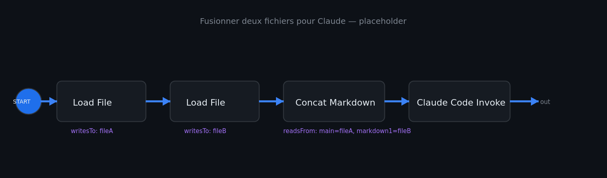

This example shows how to **assemble several sources** before calling the model, using **template variables** to decouple loading from merging.

The scenario: two Markdown files are read, each stored in a variable, merged by [Concat Markdown](/en/nodes/concat-markdown/), and the whole thing is sent as a prompt to [Claude Code Invoke](/en/nodes/claude-code-invoke/).

```
(Start) → [ Load File ] → [ Load File ] → [ Concat Markdown ] → [ Claude Code Invoke ] → out
            writesTo:        writesTo:        readsFrom:
            fileA            fileB            main=fileA, markdown1=fileB
```



The **Start** is the workflow entry marker: it points to the first node. The two loads run in sequence, then the merge reads both variables.

## Variables, in brief

An **output** port can publish its artifact into a **template variable** (`writesTo`), and an **input** port can read a variable (`readsFrom`) — with no direct wire between the two nodes. That's what lets the two loads feed the merge here without wiring their ports one to one.

## 1. Declare the two variables

In the template inspector, declare two variables (role `internal`, the default):

| Name | Kind |
| --- | --- |
| `fileA` | `Markdown` |
| `fileB` | `Markdown` |

## 2. Load the first file → `fileA`

Add a [Load File](/en/nodes/overview/) node (`file.load`). It's the **entry node**: connect the **Start** to it.

| Setting | Value |
| --- | --- |
| `path` (config) | **absolute** path of the first file |
| `outputKind` | `Markdown` |
| `writesTo.out` | `fileA` |

At runtime, it reads the file and **publishes** its content into the `fileA` variable.

## 3. Load the second file → `fileB`

Add a second **Load File**, chained after the first (transition `Load File #1 → Load File #2`).

| Setting | Value |
| --- | --- |
| `path` (config) | **absolute** path of the second file |
| `outputKind` | `Markdown` |
| `writesTo.out` | `fileB` |

It publishes its content into `fileB`.

## 4. Merge — Concat Markdown

Add a [Concat Markdown](/en/nodes/concat-markdown/) node, chained after the second load.

| Setting | Value |
| --- | --- |
| `mode` | `concat` |
| `readsFrom.main` | `fileA` |
| `readsFrom.markdown1` | `fileB` |
| `separator` | `\n\n` (default) |

Rather than wiring the two loads' outputs onto its ports, the node **pulls** `fileA` into its `main` port and `fileB` into `markdown1` via `readsFrom`. The transition from the second load only **orders** execution: by the time the merge runs, both variables are already filled.

Its `out` output is a single `Markdown`: `fileA`, a separator, then `fileB`.

## 5. Send to Claude

Add a [Claude Code Invoke](/en/nodes/claude-code-invoke/) and wire `Concat Markdown.out` → `Claude Code Invoke.prompt`.

| Setting | Value |
| --- | --- |
| `model` | `claude-opus-4-7` |
| `outputKind` | `Markdown` |

The merged Markdown becomes the prompt sent to the model.

## 6. The run

1. **Load File #1** reads the first file → `fileA`.
2. **Load File #2** reads the second file → `fileB`.
3. **Concat Markdown** reads `fileA` and `fileB`, merges them, and emits the combined Markdown.
4. **Claude Code Invoke** receives that Markdown as its prompt and produces the answer on `out`.

## What's next?

- Switch Concat Markdown to **`template` mode**: make `fileA` a template with a `{{excerpt}}` placeholder filled by `fileB`, to insert a source at the right spot rather than just appending it.
- Replace the loads with a single [Load Files](/en/nodes/overview/) (`files.load`) that reads N files under a base directory.
- Add a [human-validation loop](/en/tutorials/human-validation-loop/) on the Claude Code Invoke.
