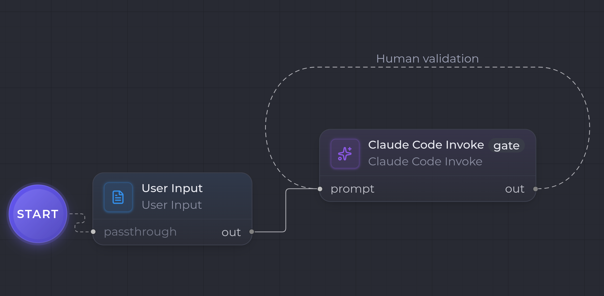

This second example takes the [minimal workflow](/en/tutorials/user-input-claude-invoke/) and adds a **looping human validation** — with no extra node. You simply **check human validation on the generation node**: its output goes through a checkpoint, and if the person requests an adjustment, the model is **re-invoked with their feedback**, without starting over.

This is the heart of the product: iterating on a step with the context preserved.

```
[ User Input ] --(Markdown)--> [ Claude Code Invoke ✓ human validation ]
                                        ▲                        │
                                        └──── feedback (isLoop loop) ────┘
```



## What you need

- The [first example](/en/tutorials/user-input-claude-invoke/) under your belt: you know how to wire [User Input](/en/nodes/user-input/) → [Claude Code Invoke](/en/nodes/claude-code-invoke/).

## 1. The base — input then generation

Reuse the two nodes from the [Prompt → answer](/en/tutorials/user-input-claude-invoke/) example:

- **User Input** — `outputKind: Markdown`.
- **Claude Code Invoke** — `model: claude-opus-4-7`, `outputKind: Markdown`.

Wire `User Input.out` → `Claude Code Invoke.prompt`.

## 2. Enable human validation on the generation

Select the **Claude Code Invoke** node and, in the inspector (the "Behavior" section), check **"Requires human validation"** (`humanGateRequired`).

At runtime, as soon as the node has produced its output, it pauses the workflow (`awaiting-human`) instead of continuing: its answer awaits a decision. No separate Human Gate node is needed — the pause is carried by the generation node itself.

:::tip[The actor role]
The role expected for the validation comes from `config.actorRole` (else the step's role, else `Developer`). It determines who is asked to approve.
:::

## 3. The feedback loop (self-loop)

For "request an adjustment" to restart the generation, add a **loop transition from the node back to itself**. Draw an edge from **Claude Code Invoke** to **Claude Code Invoke**, then, with the edge selected, toggle **"Feedback loop (dashed)"** (`isLoop`) in the inspector.

```
Claude Code Invoke ──(isLoop)──▶ Claude Code Invoke   (self-loop)
```

This edge is only taken when the human **requests an adjustment**. It carries no artifact: it tells the orchestrator to re-invoke the node, injecting the feedback into it.

## 4. The run

Start the workflow and provide the seed. The flow:

1. **User Input** emits the seed as `Markdown`.
2. **Claude Code Invoke** produces a first answer, then pauses the run (human validation checked).
3. The person decides:
   - **Approve** → the workflow moves on (here, it ends).
   - **Request an adjustment** → the orchestrator re-invokes the **same** node, with the feedback appended to its `loopHistory`. The model regenerates taking the comment into account, and the new answer goes back through validation.

The "generate → validate → adjust" cycle repeats until approval. Each round keeps the context of the previous ones: the model doesn't start from scratch, it corrects.

## Variant — a dedicated Human Gate node

Checking validation on the node keeps the workflow compact. If you prefer an **explicit checkpoint** in the graph — e.g. to validate an artifact of a different kind, or to materialize the review step — add a [Human Gate](/en/nodes/human-gate/) node downstream instead:

```
[ Claude Code Invoke ] --(Markdown)--> [ Human Gate ]
          ▲                                  │
          └──────── feedback (isLoop) ───────┘
```

The wiring: `Claude Code Invoke.out` → `Human Gate.artifact`, and the `isLoop` transition goes from the **Human Gate** back to the **Claude Code Invoke** (no longer from the node to itself). The loop behavior is identical; only the pause point changes.

## What's next?

- Replace the human validation with an **LLM Judge** (`llm.judge`) for an **automatic** loop: the judge approves / rejects, and an `isLoop` transition restarts the generation on rejection.
- Enrich the upstream prompt with a [Skill Loader](/en/nodes/skill-loader/) and a [Concat Markdown](/en/nodes/concat-markdown/).
