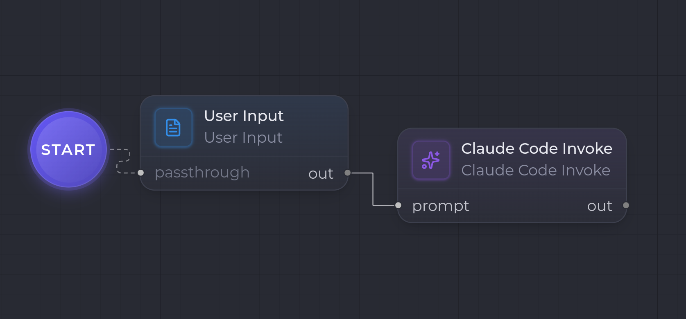

This first example builds the **simplest possible workflow**: the user types some text, the text is sent to a model as a prompt, and the model's answer is produced as an artifact.

It boils down to two nodes wired end to end:

```
[ User Input ] --(Markdown)--> [ Claude Code Invoke ] --(Markdown)--> out
```



## What you need

- An empty template open in the workflow studio.
- The [User Input](/en/nodes/user-input/) and [Claude Code Invoke](/en/nodes/claude-code-invoke/) nodes (the **Sources / Inputs** and **AI generation** families in the palette).

## 1. The entry point — User Input

Add a **User Input** node. It captures the _seed_: the text the user provides when the run starts.

Configuration:

| Key | Value |
| --- | --- |
| `outputKind` | `Markdown` |

Its `out` port emits a `Markdown` artifact containing the input as-is.

## 2. The generation — Claude Code Invoke

Add a **Claude Code Invoke** node. It takes its `prompt` input port, sends it to the model, and produces the answer on `out`.

Configuration:

| Key | Value |
| --- | --- |
| `model` | `claude-opus-4-7` |
| `outputKind` | `Markdown` |
| `maxTokens` | `8000` |

## 3. The wiring

Connect the **User Input** `out` output to the **Claude Code Invoke** `prompt` input.

The `prompt` port is polymorphic (`*`): it accepts any kind and sends the artifact content as the user prompt. The `Markdown` input therefore flows straight through, with no transformation.

## 4. The run

Start the workflow. CtxFirst asks for the seed input (the User Input node), then:

1. **User Input** serializes the text to `Markdown` and emits it on `out`.
2. **Claude Code Invoke** receives that Markdown as its prompt, invokes the model in streaming, and produces the answer as `Markdown` on its `out`.

The final `out` artifact is the model's answer — visible in the run detail.

## What's next?

- Insert a [Human Gate](/en/nodes/human-gate/) between the model and the rest to validate the answer before continuing.
- Replace the raw prompt with a reusable library prompt using a [Skill Loader](/en/nodes/skill-loader/) upstream.
- Assemble several fragments into a single prompt with Concat Markdown.
