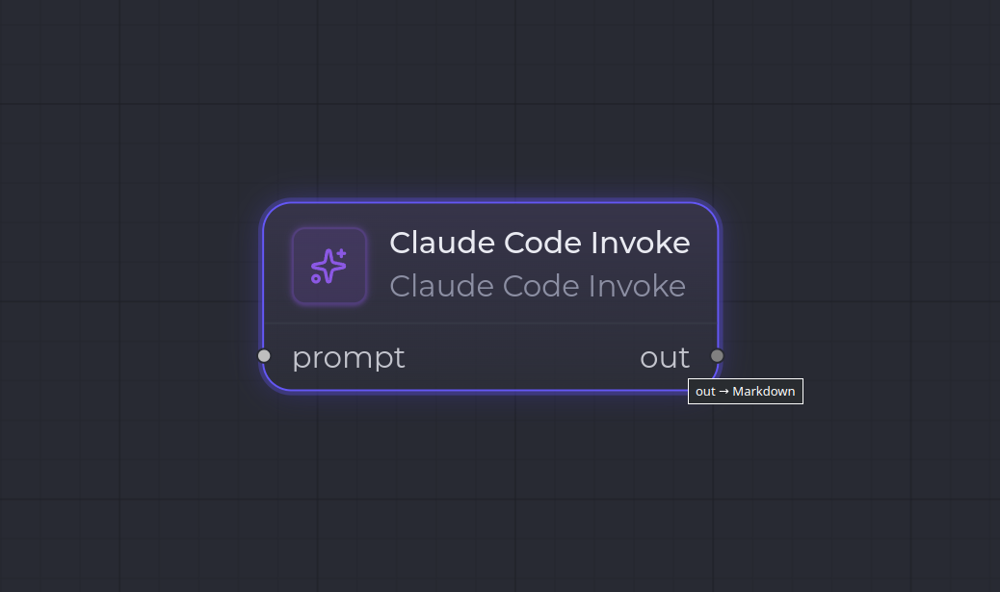

`claude_code.invoke`

**Claude Code Invoke** invoque un modèle LLM : il prend la valeur de son port d'entrée `prompt`, l'envoie au modèle (en streaming), et produit la sortie sous forme d'artifact typé sur `out`.

C'est le node « agent » central d'un workflow : on lui branche en amont un prompt (par exemple via [Skill Loader](/fr/nodes/skill-loader/) ou [User Input](/fr/nodes/user-input/)) et on récupère en aval le résultat du modèle.

## Ports

| Sens | Port | Kind | Notes |
| --- | --- | --- | --- |
| Entrée | `prompt` | `*` | Port polymorphe : `inputs[0].content` est envoyé comme prompt utilisateur, quel que soit le kind. |
| Sortie | `out` | `config.outputKind` | La sortie du modèle, sérialisée dans le kind cible. |

## Configuration

| Clé | Type | Défaut | Description |
| --- | --- | --- | --- |
| `outputKind` | `string` (ArtifactKind) | `Markdown` | Kind de l'artifact produit. **Obligatoire**. |
| `model` | `string` | `claude-opus-4-7` | Modèle invoqué. |
| `maxTokens` | `number` | `8000` | Plafond de tokens en sortie. |
| `actorRole` | `string` | `Developer` | Rôle attribué quand une validation humaine est requise (voir ci-dessous). |

## Comportement à l'exécution

1. Lit la config (`model`, `maxTokens`, `outputKind`) — erreur si `outputKind` manque, ou si aucune valeur n'est présente sur `prompt`.
2. Assemble le prompt (entrée + historique de boucle) via le _context assembler_.
3. Invoque le modèle en **streaming** : les events typés sont émis sur le bus de session.
4. Sérialise la sortie dans `outputKind`, stocke l'artifact (avec métadonnées : provider, tokens, latence, coût).
5. Enregistre une ligne de **run-log** (provider, modèle, tokens, coût, latence, ref de sortie).
6. Si le step a `humanGateRequired`, retourne `produced-pending-human` (avec `actorRole`) ; sinon `produced`.

## Exemple

- `model`: `claude-opus-4-7`, `outputKind`: `Markdown`.
- Entrée `prompt` ← sortie d'un [Skill Loader](/fr/nodes/skill-loader/).
- Sortie `out` (`Markdown`) → entrée d'un [Human Gate](/fr/nodes/human-gate/) pour validation.

## Voir aussi

- [Vue d'ensemble des nodes](/fr/nodes/overview/)
- [Skill Loader](/fr/nodes/skill-loader/) — fournit un prompt réutilisable en amont.
- [Human Gate](/fr/nodes/human-gate/) — valide la sortie en aval.
