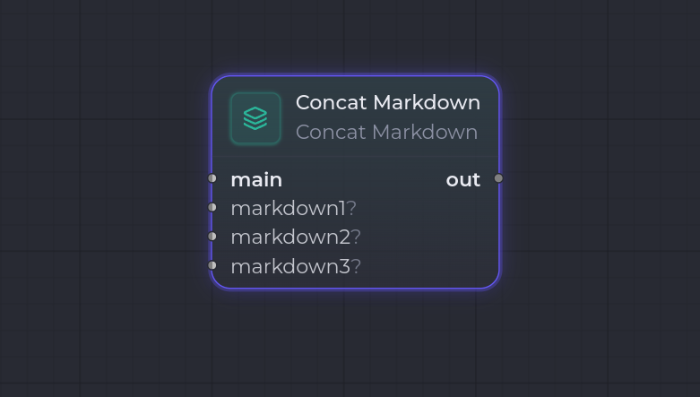

`concat.markdown`

**Concat Markdown** assemble un Markdown principal (`main`) avec jusqu'à 3 fragments additionnels optionnels (Markdown ou JSON) pour produire un unique artifact `Markdown` sur le port `out`.

Il fonctionne selon deux modes :

- **`concat`** (défaut) — concatène les fragments câblés dans l'ordre, séparés par un `separator`, avec un `header` / `footer` global et, par port, un en-tête / pied de page.
- **`template`** — le port `main` devient un **gabarit** dont les placeholders `{{name}}` sont substitués par le contenu des autres ports, adressés par **nom de variable**.

## Ports

| Sens | Port | Kind | Notes |
| --- | --- | --- | --- |
| Entrée | `main` | `Markdown`, `Json` | **Port primaire.** En mode `concat`, le premier fragment ; en mode `template`, le gabarit (obligatoire). |
| Entrée | `markdown1` | `Markdown`, `Json` | **Optionnel.** Fragment additionnel / valeur de placeholder. |
| Entrée | `markdown2` | `Markdown`, `Json` | **Optionnel.** Fragment additionnel / valeur de placeholder. |
| Entrée | `markdown3` | `Markdown`, `Json` | **Optionnel.** Fragment additionnel / valeur de placeholder. |
| Sortie | `out` | `Markdown` | Port primaire : le Markdown assemblé. |

Pour les ports recevant du `Json`, c'est le champ `body` du payload qui est utilisé (repli sur le contenu brut sinon) — pratique pour insérer un exemple JSON dans un prompt.

## Configuration

| Clé | Type | Défaut | Description |
| --- | --- | --- | --- |
| `mode` | `"concat"` \| `"template"` | `"concat"` | Mode d'assemblage. |
| `separator` | `string` | `"\n\n"` | Séparateur inséré entre les segments. |
| `header` | `string` | `""` | Texte global ajouté en tête de la sortie (si non vide). |
| `footer` | `string` | `""` | Texte global ajouté en pied de la sortie (si non vide). |

### Mode `concat`

| Clé | Type | Défaut | Description |
| --- | --- | --- | --- |
| `order` | `"top-to-bottom"` \| `"bottom-to-top"` | `"top-to-bottom"` | Ordre de concaténation des fragments. |
| `entries.<port>.header` | `string` | `""` | En-tête inséré avant le fragment du port (`main`, `markdown1`…). |
| `entries.<port>.footer` | `string` | `""` | Pied inséré après le fragment du port. |

### Mode `template`

| Clé | Type | Défaut | Description |
| --- | --- | --- | --- |
| `readsFrom.<port>` | `string` | nom du port | Nom de variable sous lequel le contenu d'un port est exposé aux placeholders `{{name}}`. |
| `onMissing` | `"keep"` \| `"empty"` \| `"error"` | `"keep"` | Politique pour un placeholder non fourni : laisser tel quel, remplacer par du vide, ou échouer. |
| `onUnused` | `"append"` \| `"ignore"` | `"append"` | Politique pour un port câblé non référencé dans le gabarit : l'ajouter en fin de sortie, ou l'ignorer. |

## Comportement à l'exécution

### Mode `concat`

1. Le runner lit `mode`, `separator`, `header`, `footer` et `order`.
2. Pour chaque port câblé (`main`, `markdown1`, `markdown2`, `markdown3`), il extrait le body et l'enveloppe avec son `entries.<port>.header` / `footer` éventuel.
3. Si `order` vaut `bottom-to-top`, l'ordre des fragments est inversé.
4. Les fragments sont joints par `separator`, encadrés par le `header` / `footer` global, et stockés en `Markdown` sur `out` (métadonnées `source: "concat.markdown"`, `partCount`).

### Mode `template`

1. Le port `main` est lu comme gabarit (erreur s'il n'est pas câblé).
2. Le contenu de `markdown1` / `markdown2` / `markdown3` est mappé à un nom de variable via `readsFrom` (repli sur le nom de port).
3. Les placeholders `{{name}}` du gabarit sont substitués selon `onMissing` ; les ports câblés non référencés sont traités selon `onUnused`.
4. Le résultat est encadré par `header` / `footer` et stocké en `Markdown` sur `out` (métadonnées `mode: "template"`, `missing`, `unused`).

## Exemples

### Concaténer un prompt et un exemple

- `main` (`Markdown`) ← une consigne.
- `markdown1` (`Json`) ← un exemple de payload attendu.
- `entries.markdown1.header`: `` "## Exemple\n" `` pour titrer le fragment inséré.
- Sortie `out` → entrée d'un node `claude_code.invoke`.

### Remplir un gabarit

- `mode`: `template`.
- `main` (`Markdown`) ← un gabarit `Bonjour {{user}}, voici {{data}}.`
- `markdown1` avec `readsFrom.markdown1`: `user`, `markdown2` avec `readsFrom.markdown2`: `data`.
- `onMissing`: `error` pour échouer si une variable manque.

## Voir aussi

- [Vue d'ensemble des nodes](/fr/nodes/overview/)
- [Render Markdown](/fr/nodes/render-markdown/) — rend un gabarit Markdown depuis une source unique.
</content>
</invoke>
