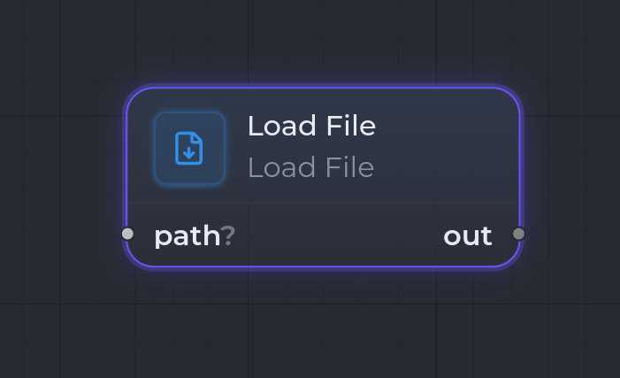

`file.load`

**Load File** lit un fichier texte unique et expose son contenu comme artifact du kind choisi (`config.outputKind`, polymorphe). Le chemin provient du port d'entrée `path` ou de `config.path` — l'entrée l'emporte quand les deux sont présents (même pattern que `webhook.call` pour l'URL). Aucun [Workspace Set](/fr/nodes/workspace-set/) en amont n'est requis : le chemin doit être **absolu**.

Le contenu d'un fichier étant du texte, seuls les kinds **text-envelope** (`{ format, body }`) ont un sens en sortie : **Markdown** et **Json**. Pour `Json`, le body est parsé au chargement pour échouer tôt sur un JSON malformé.

## Ports

| Sens | Port | Kind | Notes |
| --- | --- | --- | --- |
| Entrée | `path` | `Path`, `String`, `Markdown`, `*` | **Optionnel**, primaire. Quand câblé, il l'emporte sur `config.path`. Le chemin est lu depuis le payload (`Path` → `path`, scalaire `String` → `value`, envelope texte → `body`) avec un repli sur le contenu brut. |
| Sortie | `out` | `config.outputKind` | Primaire. Le contenu du fichier sérialisé dans le kind choisi. Aucun port de sortie n'apparaît tant que `outputKind` n'est pas réglé. |

## Configuration

| Clé | Type | Défaut | Description |
| --- | --- | --- | --- |
| `outputKind` | `string` (`Markdown` \| `Json`) | — | Kind de l'artifact produit. **Obligatoire** — le runner échoue si absent ou non supporté. |
| `path` | `string` | — | Chemin absolu du fichier à lire. Utilisé uniquement quand l'entrée `path` n'est pas câblée. |

## Comportement à l'exécution

1. Le runner lit `config.outputKind` (erreur si absent, ou si différent de `Markdown`/`Json`).
2. Il résout le chemin : entrée `path` si câblée, sinon `config.path` (erreur si aucun des deux n'est défini).
3. Il vérifie que le chemin est **absolu** (erreur sinon) et lit le fichier (erreur si vide).
4. Pour `Json`, il parse le body pour échouer tôt sur un JSON invalide.
5. Il stocke l'artifact (`{ format, body }`) avec les métadonnées `source`, `path` et `byteLength`, et le produit sur `out`.

## Exemple

Charger une spec Markdown depuis le disque et l'envoyer à un agent :

- `outputKind` : `Markdown`, `path` : le chemin absolu du fichier (ou câbler l'entrée `path`).
- Sortie `out` (`Markdown`) → entrée d'un [Claude Code Invoke](/fr/nodes/claude-code-invoke/) en aval.

## Voir aussi

- [Vue d'ensemble des nodes](/fr/nodes/overview/)
- **Load Files** (`files.load`) — la variante multi-fichiers (lit N fichiers sous un répertoire de base).
- [Git Clone](/fr/nodes/git-clone/) — produit un `Path` que vous pouvez câbler sur l'entrée `path`.
