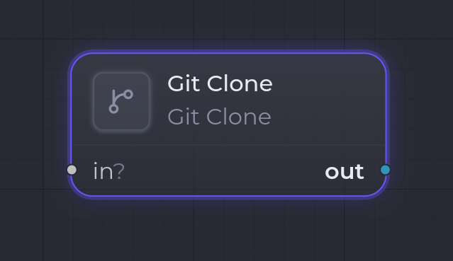

`git.clone`

**Git Clone** clone un dépôt git distant (GitLab via access token, mais provider-agnostique) dans un dossier choisi et émet le **chemin absolu** du clone comme artifact `Path`. C'est ce chemin que vous câblez dans un [Workspace Set](/fr/nodes/workspace-set/) en aval (ou un `git.worktree.create`) pour que la suite du run opère dans le clone.

Il est conçu **idempotent** : avec `cleanBefore` (le défaut), la cible est wipe-and-recloned, donc rejouer l'étape redonne exactement le même état.

## Ports

| Sens | Port | Kind | Notes |
| --- | --- | --- | --- |
| Entrée | `in` | `*` | **Optionnel**, non consommé — disponible pour le chaînage. |
| Sortie | `out` | `Path` | Primaire. Chemin absolu du dépôt cloné. |

## Configuration

| Clé | Type | Défaut | Description |
| --- | --- | --- | --- |
| `repoUrl` | `string` | — | URL HTTPS du dépôt. **Obligatoire** — doit commencer par `https://`. |
| `baseDir` | `string` | dossier de clones managé | Répertoire racine qui contient le clone. Par défaut, la racine de clones managée par l'app quand vide. |
| `folder` | `string` | — | Sous-chemin du clone dans `baseDir`. **Obligatoire** — ne doit pas contenir `..`. |
| `branch` | `string` | défaut du dépôt | Branche à checkout. Validée comme nom de branche git. |
| `cleanBefore` | `boolean` | `true` | Si `true`, wipe la cible avant le clone (idempotent). Si `false`, échoue si la cible existe et est non vide. |

La cible (`baseDir`/`folder`) est toujours résolue **à l'intérieur** de `baseDir` — elle ne peut jamais en sortir, et ni le wipe ni le clone ne peuvent toucher quoi que ce soit en dehors.

## Sécurité

- L'access token est résolu à l'exécution (settings chiffrés, comme Linear / OpenRouter, avec un repli sur la variable d'env `GITLAB_TOKEN`), jamais stocké dans le template.
- Le token est **rédigé** dans tout message d'erreur et métadonnée, et l'origin est réécrit sans token après le clone.

## Comportement à l'exécution

1. Le runner parse la config (erreur si `repoUrl`, `baseDir` ou `folder` est absent/invalide).
2. Il résout la `target` contenue dans `baseDir`.
3. Si `cleanBefore`, il wipe la cible ; sinon il échoue si la cible existe et est non vide.
4. Il résout l'access token (settings, puis `GITLAB_TOKEN`).
5. Il clone le dépôt (optionnellement sur `branch`) dans la cible, puis réécrit l'origin sans le token.
6. Il stocke un artifact `Path` pointant sur le clone (métadonnées : `provider: git`, `repoUrl` rédigée, `branch`) et le produit sur `out`.

## Exemple

Cloner un dépôt, puis opérer dedans :

- `repoUrl` : l'URL HTTPS, `folder` : un nom de sous-dossier, `branch` : la branche cible.
- Sortie `out` (`Path`) → câblez-la sur le `cwd` d'un [Workspace Set](/fr/nodes/workspace-set/), puis un [Claude Code Invoke](/fr/nodes/claude-code-invoke/) et un [Git Commit & Push](/fr/nodes/git-commit-push/).

## Voir aussi

- [Vue d'ensemble des nodes](/fr/nodes/overview/)
- [Workspace Set](/fr/nodes/workspace-set/) — consomme le chemin produit comme répertoire de travail.
- [Git Commit & Push](/fr/nodes/git-commit-push/) — pousse les changements faits dans le clone.
