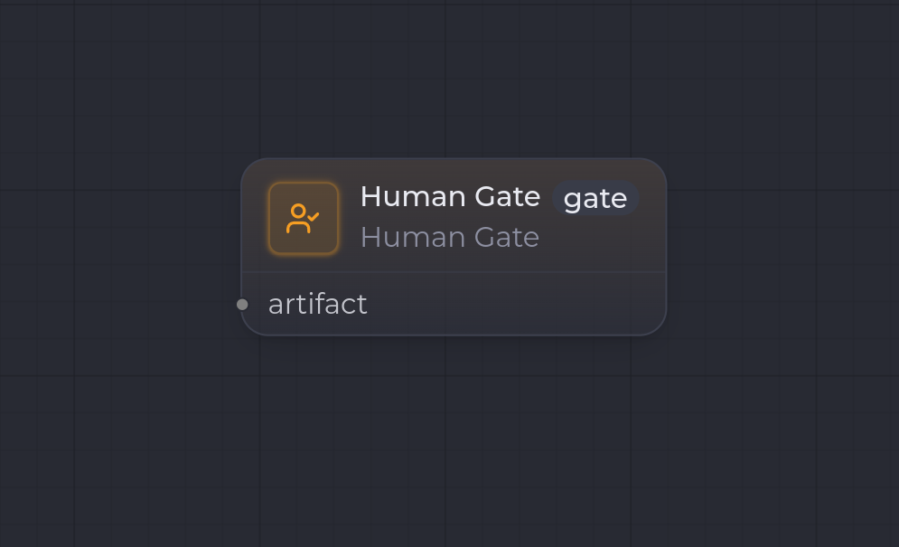

`human.gate`

**Human Gate** est un **point de contrôle humain** : il met le workflow en pause jusqu'à ce qu'une personne valide l'artifact produit en amont. C'est le mécanisme qui matérialise les « validations humaines à des moments clés » du produit.

## Ports

| Sens | Port | Kind | Notes |
| --- | --- | --- | --- |
| Entrée | `artifact` | `config.inputKind` | L'artifact à valider. Le kind attendu est fixé par la config. |
| Sortie | — | — | Aucun port de sortie : le node ne produit pas d'artifact, il porte une décision de flux. |

## Configuration

| Clé | Type | Défaut | Description |
| --- | --- | --- | --- |
| `inputKind` | `string` (ArtifactKind) | `Markdown` | Kind de l'artifact sur lequel le node se met en pause. **Obligatoire**. |
| `role` | `string` | `Developer` | Rôle de l'acteur attendu pour la validation. |
| `prompt` | `string` | `Valider ou demander un ajustement.` | Consigne affichée à l'humain. |

## Comportement à l'exécution

1. Le runner lit `config.inputKind` (résolution du spec) et `config.role`.
2. Au `run`, il retourne immédiatement `awaiting-human` avec le `role` — le workflow se met en pause.
3. La reprise est pilotée par l'interaction humaine (validation ou demande d'ajustement / boucle de feedback), hors du runner.

:::note
À la différence d'un node `claude_code.invoke` avec `humanGateRequired`, qui **produit** d'abord un artifact puis attend (`produced-pending-human`), Human Gate est un node dédié : il ne produit rien, il **bloque** uniquement sur l'artifact amont.
:::

## Exemple

- `inputKind`: `Markdown`, `role`: `Developer`.
- Entrée `artifact` ← sortie d'un [Claude Code Invoke](/fr/nodes/claude-code-invoke/).
- Le workflow attend la validation avant de poursuivre vers les nodes suivants.

## Voir aussi

- [Vue d'ensemble des nodes](/fr/nodes/overview/)
- [Claude Code Invoke](/fr/nodes/claude-code-invoke/) — produit l'artifact soumis à validation.
