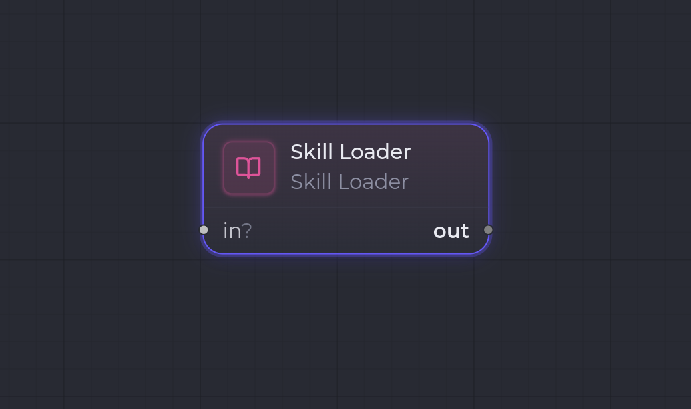

`skill.loader`

**Skill Loader** résout une **skill** (un _prompt_ persisté dans la bibliothèque) référencée par sa config, et expose son `body` sous forme d'artifact `Markdown` sur le port `out`.

Il sert typiquement à brancher un prompt réutilisable en amont d'un node `claude_code.invoke` (ou autre agent) qui consomme ce Markdown comme entrée. Le node est **découplé** de l'agent : aucune dépendance au niveau config, la connexion se fait via les transitions du workflow.

## Ports

| Sens | Port | Kind | Notes |
| --- | --- | --- | --- |
| Entrée | `in` | `*` | **Optionnel**, non consommé. Disponible pour le chaînage (ex. derrière un `workspace.set` passthrough). |
| Sortie | `out` | `Markdown` | Port primaire : le `body` de la skill résolue. |

## Configuration

| Clé | Type | Défaut | Description |
| --- | --- | --- | --- |
| `skillRef` | `string` | `""` | Référence de la skill à charger depuis la bibliothèque. **Obligatoire** — le runner échoue si vide. |

## Comportement à l'exécution

1. Le runner lit `config.skillRef` (erreur si vide ou absent).
2. Il résout la skill via la `SkillRegistry` (`ctx.deps.skills`) — erreur si le registre n'est pas câblé.
3. Il construit un payload `Markdown` à partir du `body` de la skill.
4. Il stocke le payload et produit l'artifact sur `out`, avec les métadonnées `source: "skill.loader"`, `skillRef` et `byteLength`.

## Exemple

Charger un prompt « code review » et l'envoyer à un agent :

- `skillRef`: la référence de la skill voulue.
- Sortie `out` (`Markdown`) → câblée sur l'entrée d'un node `claude_code.invoke` en aval.

## Voir aussi

- [Vue d'ensemble des nodes](/fr/nodes/overview/)
- [User Input](/fr/nodes/user-input/) — l'autre node source (saisie utilisateur plutôt que prompt de bibliothèque).
