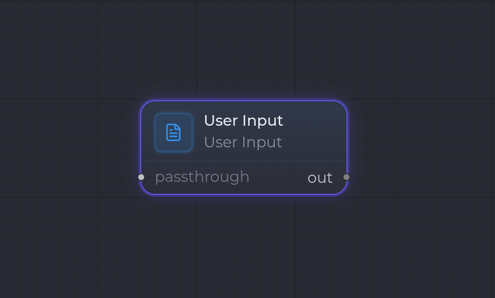

`user.input`

**User Input** est le **point d'entrée** d'un workflow : il capture la _seed_ (la donnée de départ) fournie par l'utilisateur et l'émet sous forme d'artifact typé, prêt à alimenter les nodes suivants.

C'est typiquement le premier node d'un template : la saisie collée par l'utilisateur (spec, brief, URL…) devient le premier artifact du run.

## Ports

| Sens | Port | Kind | Notes |
| --- | --- | --- | --- |
| Entrée | — | — | Aucun port d'entrée câblé : la valeur vient de la saisie utilisateur. |
| Sortie | `out` | `config.outputKind` | Le kind de l'artifact produit, défini par la config. |

Le node ne consomme pas d'artifact d'un node amont : il est en tête de chaîne. La donnée fournie par l'utilisateur est sérialisée selon `outputKind`, puis émise sur le port `out`.

## Configuration

| Clé | Type | Défaut | Description |
| --- | --- | --- | --- |
| `outputKind` | `string` (ArtifactKind) | `Markdown` | Kind de l'artifact émis. **Obligatoire** — le runner échoue si absent. |

- Pour un **kind builtin** (ex. `Markdown`, `Json`…), la saisie brute est convertie via le sérialiseur du kind.
- Pour un **kind custom**, la saisie doit être du **JSON valide** correspondant au payload du kind ; sinon l'exécution échoue avec une erreur de sérialisation.

## Comportement à l'exécution

1. Le runner lit `config.outputKind` (erreur si manquant).
2. Il récupère la saisie utilisateur (erreur si aucune entrée n'est fournie).
3. Il sérialise la chaîne dans le payload du kind cible (`serializeFromString`).
4. Il stocke le payload et produit l'artifact sur `out` (avec `sourceKind` = kind de la saisie).

## Exemple

Premier node d'un workflow de spec : l'utilisateur colle un brief Markdown.

- `outputKind`: `Markdown`
- Sortie `out` → artifact `Markdown` consommé par un node `claude_code.invoke` en aval.

## Voir aussi

- [Vue d'ensemble des nodes](/fr/nodes/overview/)
- **Human Gate** (`human.gate`) — l'équivalent côté validation : un point de contrôle humain dans le flux.
