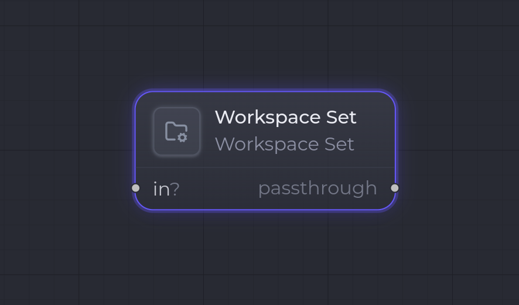

`workspace.set`

**Workspace Set** fixe le **répertoire de travail** (`cwd`) utilisé par les étapes natives qui suivent — typiquement un [Claude Code Invoke](/fr/nodes/claude-code-invoke/) (la CLI Claude s'y exécute) ou un [Git Commit & Push](/fr/nodes/git-commit-push/). Il ne produit aucun artifact : c'est un effet de bord pur sur l'état du run, gardé chaînable pour pouvoir se placer au milieu d'un flow.

## Ports

| Sens | Port | Kind | Notes |
| --- | --- | --- | --- |
| Entrée | `in` | `*` | **Optionnel**, **non consommé** — sert uniquement à chaîner le node dans le flow. Son contenu est ignoré à l'exécution. |
| Sortie | — | — | Aucun port de sortie. Le node est un **passthrough** : l'orchestrateur le saute lors de la résolution des entrées de l'étape en aval. |

## Configuration

| Clé | Type | Défaut | Description |
| --- | --- | --- | --- |
| `cwd` | `string` | `""` | Répertoire de travail appliqué aux étapes natives suivantes. **Obligatoire** — le runner échoue si vide. Lu uniquement depuis la config (le champ de l'inspecteur), jamais depuis le port d'entrée. |

## Comportement à l'exécution

1. Le runner lit `step.config.cwd` et le trim (erreur si vide ou absent).
2. Il retourne un outcome `workspace-set` portant le `cwd`.
3. L'orchestrateur émet un événement `WorkspaceChanged`, puis **auto-valide** l'étape (pas de gate humain, pas d'artifact).
4. Le node étant un passthrough, la prochaine étape qui a besoin d'un artifact amont le résout **par-dessus** ce node (son `previousDataStepId` saute le `workspace.set`).

## Exemple

Pointer le run sur un répertoire de projet avant d'invoquer un agent :

- `cwd` : le chemin absolu du projet.
- Entrée `in` ← (optionnel) la sortie d'un node précédent, juste pour le chaînage.
- Un [Claude Code Invoke](/fr/nodes/claude-code-invoke/) en aval exécute alors la CLI Claude dans ce répertoire.

:::note
Pour un dépôt fraîchement cloné, câblez la sortie `out` (`Path`) d'un [Git Clone](/fr/nodes/git-clone/) dans le flow et réglez `cwd` en conséquence, ou utilisez une étape `git.worktree.create`, qui fixe elle-même le workspace.
:::

## Voir aussi

- [Vue d'ensemble des nodes](/fr/nodes/overview/)
- [Git Clone](/fr/nodes/git-clone/) — produit le chemin que vous voudrez peut-être poser comme workspace.
- [Git Commit & Push](/fr/nodes/git-commit-push/) — une étape native qui s'exécute dans le `cwd` configuré.
