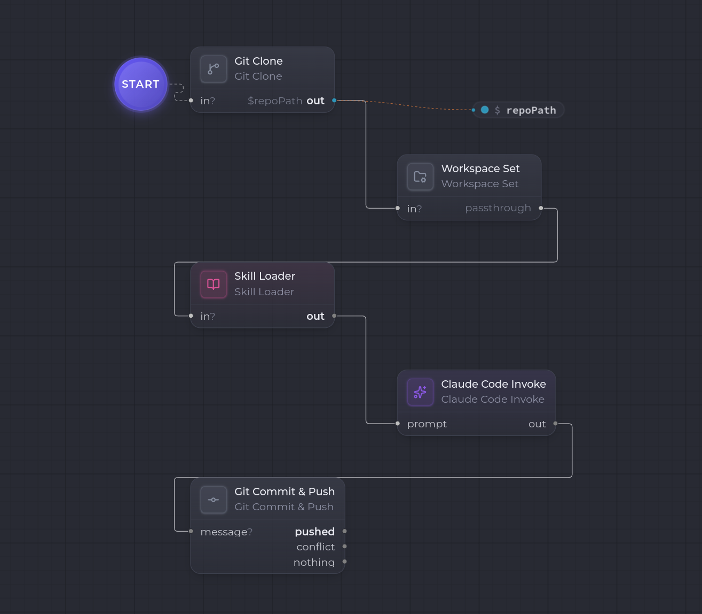

Cet exemple enchaîne un workflow **de bout en bout sur un vrai dépôt** : on clone un repo distant, on pose une **skill** comme consigne, on laisse [Claude Code Invoke](/fr/nodes/claude-code-invoke/) modifier les fichiers, puis on **commite et pousse** le résultat.

Le scénario : [Git Clone](/fr/nodes/overview/) récupère le dépôt, [Workspace Set](/fr/nodes/overview/) fixe le répertoire de travail sur le clone, [Skill Loader](/fr/nodes/skill-loader/) fournit la consigne, [Claude Code Invoke](/fr/nodes/claude-code-invoke/) exécute la tâche **dans** le dépôt, et [Git Commit & Push](/fr/nodes/overview/) publie les changements.

```
(Start) → [ Git Clone ] → [ Workspace Set ] → [ Skill Loader ] → [ Claude Code Invoke ] → [ Git Commit & Push ] → pushed
            out: Path        cwd = baseDir/      out: Markdown      prompt ← skill body       message ← out (résumé)
                             folder (le clone)   (la consigne)      cwd = le clone           cwd = le clone
```



Le point clé de ce workflow est le **répertoire de travail** (`cwd`). Les nodes natifs (Claude, commit) n'agissent pas sur la sortie d'un node précédent : ils agissent sur le **dossier courant du run**. C'est `Workspace Set` qui pose ce dossier — et il faut qu'il pointe sur le clone.

## Le `cwd`, en bref

`Git Clone` **produit** le chemin du dépôt cloné (un artifact `Path` sur son port `out`), mais il **ne change pas** le répertoire de travail du run. C'est `Workspace Set` qui fixe le `cwd` — et il le lit **uniquement depuis sa config `cwd`** (son port d'entrée sert juste à chaîner la node, son contenu est ignoré à l'exécution).

Conséquence concrète : la valeur `cwd` de Workspace Set doit être **le même chemin** que celui où Git Clone dépose le dépôt, c'est-à-dire `baseDir/folder`. Tous les nodes en aval qui lisent le `cwd` (Claude Code Invoke, Git Commit & Push) travailleront alors dans le clone.

## 1. Cloner le dépôt — Git Clone

Ajoutez un node **Git Clone** (`git.clone`). C'est le **node d'entrée** : reliez-y le **Start**.

| Réglage | Valeur |
| --- | --- |
| `repoUrl` | URL du dépôt distant (clone GitLab via token d'accès) |
| `baseDir` | répertoire **absolu** parent des clones (ex. `/home/vous/clones`) |
| `folder` | sous-dossier du clone (ex. `mon-repo`) |
| `branch` | branche à cloner (optionnel) |
| `cleanBefore` | `true` (défaut) — efface la cible avant de cloner |

Le dépôt est cloné dans `baseDir/folder` (avec l'exemple ci-dessus : `/home/vous/clones/mon-repo`). Le credential GitLab est résolu au runtime depuis les réglages chiffrés de l'app, ou à défaut la variable d'environnement `GITLAB_TOKEN`.

Sa sortie `out` est un `Path` (le chemin absolu du clone). Notez ce chemin : il sert à l'étape suivante.

## 2. Fixer le répertoire de travail — Workspace Set

Ajoutez un node **Workspace Set** (`workspace.set`), enchaîné après Git Clone (transition `Git Clone → Workspace Set`).

| Réglage | Valeur |
| --- | --- |
| `cwd` | le chemin du clone, soit `baseDir/folder` (ex. `/home/vous/clones/mon-repo`) |

`Workspace Set` ne produit aucun artifact : c'est un **effet de bord** qui pose le `cwd` du run. Son port d'entrée `in` sert seulement à le placer dans le flux (passthrough) — c'est pourquoi on le branche après Git Clone même si son contenu n'est pas consommé.

:::caution[Le chemin doit correspondre]
`cwd` doit valoir **exactement** `baseDir/folder` de l'étape 1. C'est une valeur saisie à la main : si elle diverge du chemin de clone, Claude et le commit s'exécuteront dans le mauvais dossier (ou échoueront).
:::

## 3. Charger la consigne — Skill Loader

Ajoutez un node [Skill Loader](/fr/nodes/skill-loader/) (`skill.loader`), enchaîné après Workspace Set.

| Réglage | Valeur |
| --- | --- |
| `skillRef` | la référence de la skill (ex. `agent-lot`, `découpage@v1`) |

Il résout la skill dans la bibliothèque et expose son `body` comme `Markdown` sur `out`. Ce Markdown est la **consigne** envoyée à l'agent — décrivez-y la tâche à mener sur le dépôt (ce que Claude doit modifier, les contraintes, le format attendu).

## 4. Exécuter la tâche — Claude Code Invoke

Ajoutez un [Claude Code Invoke](/fr/nodes/claude-code-invoke/) (`claude_code.invoke`) et câblez `Skill Loader.out` → `Claude Code Invoke.prompt`.

| Réglage | Valeur |
| --- | --- |
| `model` | `claude-opus-4-7` |
| `outputKind` | `Markdown` |

Le `body` de la skill devient le prompt. Surtout, Claude s'exécute **dans le `cwd`** posé à l'étape 2 — c'est-à-dire dans le clone : il lit et **modifie directement les fichiers** du dépôt sur le disque. Sa sortie `out` est son compte-rendu de la tâche (Markdown).

## 5. Commiter et pousser — Git Commit & Push

Ajoutez un node **Git Commit & Push** (`git.commit_push`) et câblez `Claude Code Invoke.out` → `Git Commit & Push.message`.

| Réglage | Valeur |
| --- | --- |
| `paths` | liste des chemins à stager (ex. `["."]` ou des fichiers précis) |
| `branch` | branche cible du push |
| `remote` | `origin` (défaut) |
| `message` | message de commit (optionnel — voir ci-dessous) |
| `maxRetries` | `3` (défaut) — tentatives de rebase/push |

Comme Claude, ce node lit le `cwd` du run : il opère donc dans le clone. Il stage les `paths`, commite, rebase sur le distant, puis pousse avec `--force-with-lease`.

Le port d'entrée `message` **prime** sur la config : en câblant `Claude Code Invoke.out` dessus, le compte-rendu de Claude devient le message de commit. Pour un message propre, soit vous **demandez à la skill** de terminer par une ligne de commit concise, soit vous **ne câblez pas** ce port et renseignez un `message` fixe dans la config (la transition d'ordre vers le commit reste assurée par le `cwd` partagé et l'enchaînement du flux).

La sortie primaire `pushed` est empruntée quand le commit part vers le distant. Deux autres ports couvrent les cas particuliers : `conflict` (le rebase a buté sur un conflit, à traiter en aval) et `nothing` (arbre de travail propre — rien à committer).

## Le run

1. **Git Clone** clone `repoUrl` dans `baseDir/folder` et émet le `Path` du clone.
2. **Workspace Set** pose `cwd = baseDir/folder` : tous les nodes natifs suivants travaillent dans le clone.
3. **Skill Loader** charge la skill et émet sa consigne en `Markdown`.
4. **Claude Code Invoke** reçoit la consigne, s'exécute dans le clone, modifie les fichiers, et émet son compte-rendu.
5. **Git Commit & Push** stage les `paths`, commite (message = compte-rendu de Claude), rebase et pousse sur `origin/<branch>` → `pushed`.

## Et ensuite ?

- Intercalez un [Human Gate](/fr/nodes/human-gate/) entre Claude et le commit pour **valider la diff** avant de pousser.
- Remplacez la skill statique par un [User Input](/fr/nodes/user-input/) (ou fusionnez les deux avec [Concat Markdown](/fr/tutorials/concat-files-claude/)) pour décrire la tâche au moment du run.
- Branchez le port `conflict` de Git Commit & Push vers une étape de résolution (un second Claude, ou un Human Gate) plutôt que de laisser le run échouer.
- Isolez le travail dans un worktree dédié (`git.worktree.create`) au lieu de committer directement sur la branche clonée.
